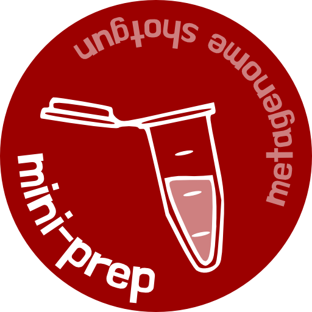
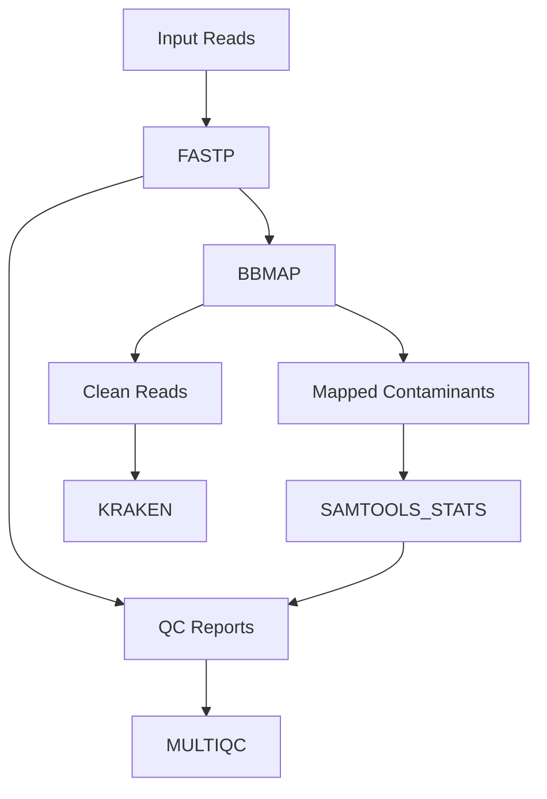

# mini-prep


This Nextflow workflow processes paired-end sequencing reads by:

1. Quality trimming and filtering with [fastp](https://github.com/OpenGene/fastp)
2. Removing contaminant sequences using [bbmap](https://github.com/BioInfoTools/BBMap)
3. Taxonomically classifying the clean reads using [kraken2](https://github.com/DerrickWood/kraken2)
4. Report using [multiqc](https://multiqc.info)

 
## Prerequisites

- **BBMap database**: Must contain `/ref/index/` directory
- **Kraken2 database**: Must contain `hash.k2d` file

## Usage

```bash
nextflow run main.nf --input_pattern "path/to/reads/*_{1,2}.fastq.gz" \
                     --contaminants_db "path/to/bbmap_db" \
                     --kraken_db "path/to/kraken_db"
```


## Workflow Steps



## Outputs

- Quality-filtered and contaminant-free reads
- Taxonomic classification of clean reads
- Comprehensive QC reports (FASTP, SAMTOOLS_STATS, MULTIQC)

## Note

Materials prepared for a training session at [the Quadram Institute](https://www.quadram.ac.uk).